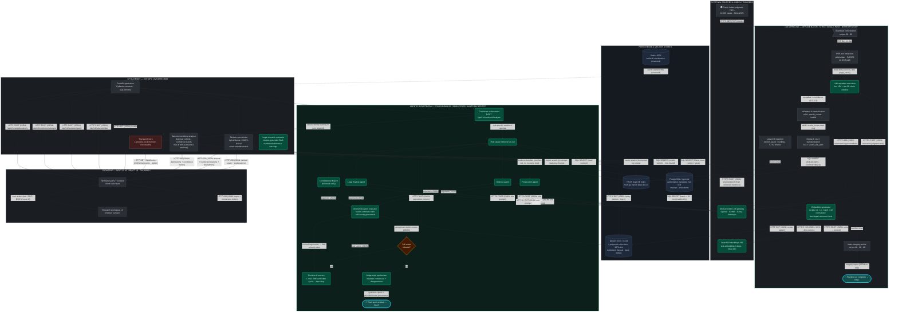

# NyayaAI — System Architecture

```mermaid
flowchart TD

    %% ══════════════ EXTERNAL SOURCES & MODEL PROVIDERS ══════════════
    subgraph EXT["EXTERNAL SOURCES & MODEL PROVIDERS"]
        SRC["🏛 Public Indian judgment PDFs<br/>10,005 cases · 2012–2025"]
        LLP("Multi-provider LLM gateway<br/>OpenAI · Gemini · Groq · Anthropic")
        OAI("OpenAI Embeddings API<br/>text-embedding-3-large · 3072-dim")
    end

    %% ══════════════ DATA PIPELINE (OFFLINE, RUN-ONCE) ══════════════
    subgraph DP["DATA PIPELINE — OFFLINE BATCH · STRICT SINGLE-PASS · NO RETRY LOOP"]
        DL>Download orchestration<br/>scripts 01 · 08]
        KBIN["Legal-KB ingestion<br/>section-aware chunking · 5,752 chunks"]
        PX["PDF text extraction<br/>pdfplumber · PyPDF2<br/>no OCR path"]
        MX("LLM metadata extraction<br/>first 15K + last 5K chars window")
        VD["Validation & normalization<br/>valid · needs_review · invalid"]
        DS["Dedup & court standardization<br/>key = source_file_path"]
        EG("Embedding generator<br/>scripts 13 · 14 · batch = 32<br/>normalized fact+legal+outcome blend")
        IV["Index integrity verifier<br/>scripts 16 · 18 · 19"]
        PHALT(["🏁 Pipeline run complete → HALT"])
    end

    %% ══════════════ PERSISTENCE LAYER ══════════════
    subgraph DB["PERSISTENCE & VECTOR STORES"]
        PG[("PostgreSQL / pgvector<br/>authoritative metadata · full text<br/>statutes · precedents")]
        QD[("Qdrant :6333 / :6334<br/>4 judgment collections · 3072-dim<br/>combined · factual · legal · fulltext")]
        FA[("FAISS legal-KB index<br/>multi-qa-mpnet-base-dot-v1")]
        RD[("Redis :6379<br/>cache & coordination (reserved)")]
    end

    %% ══════════════ API GATEWAY ══════════════
    subgraph API["API GATEWAY — FASTAPI · UVICORN :8000"]
        GW("FastAPI application<br/>Pydantic contracts · SQLAlchemy")
        SC("Similar-case service<br/>hybrid dense + BM25-lexical<br/>cross-encoder rerank")
        AS("Legal research assistant<br/>citation-grounded RAG<br/>numbered citations + warnings")
        OTS("Outcome tendency analyzer<br/>historical cohorts · confidence bands<br/>bias & drift audit (not a predictor)")
        EVS["Trial event store<br/>⚠ process-local memory · non-durable"]
    end

    %% ══════════════ AGENTIC COURTROOM (SINGLE-PASS) ══════════════
    subgraph CRT["AGENTIC COURTROOM — SYNCHRONOUS · SINGLE-PASS · HALTS ON REPORT"]
        CO("Courtroom orchestrator<br/>POST /api/v1/courtroom/analyze")
        RT("Role-aware retrieval fan-out")
        PA("Prosecution agent")
        DA("Defense agent")
        LAA("Legal Analyst agent")
        CE("Constitutional Expert<br/>(full mode only)")
        PE("Anonymous peer evaluator<br/>fixed 6-criterion rubric<br/>self-scoring prevented")
        FULL{"Full mode<br/>rebuttal?"}
        RE("Revision & rescore<br/>⚠ max ONE correction cycle — then stop")
        JS("Judge-style synthesizer<br/>exposes consensus + disagreement")
        CHALT(["🏁 Trial report emitted → HALT"])
    end

    %% ══════════════ FRONTEND ══════════════
    subgraph FE["FRONTEND — NEXT.JS 16 · REACT 19 · TAILWIND 4"]
        UI["Research workspace UI<br/>4 feature surfaces"]
        QS("TanStack Query + Zustand<br/>client state layer")
    end

    %% ── Offline ingestion flow (runs once) ──
    SRC -- "HTTPS GET (PDF binaries)" --> DL
    DL -- "PDF files on disk" --> PX
    PX -- "result dict {success, text, page_count}" --> MX
    MX -- "HTTPS POST (JSON: truncated judgment text)" --> LLP
    LLP -- "HTTPS 200 (JSON: structured legal metadata)" --> MX
    MX -- "metadata + confidence (0.0–1.0)" --> VD
    VD -- "valid / needs_review rows only" --> DS
    DS -- "SQL INSERT (SQLAlchemy · commit/rollback)" --> PG
    KBIN -- "chunk arrays" --> FA

    PG -- "SQL SELECT (batch = 32 · non-invalid only)" --> EG
    EG -- "HTTPS POST (JSON: texts → embed)" --> OAI
    OAI -- "HTTPS 200 (JSON: 3072-dim vectors)" --> EG
    EG -- "HTTP PUT (JSON: vector upsert)" --> QD
    EG -- "manifest rows" --> IV
    IV -- "integrity report (JSON on disk)" --> PHALT

    %% ── Frontend → Gateway ──
    UI -- "user action (text / PDF / DOCX / case id)" --> QS
    QS -- "HTTP GET (JSON) /health" --> GW
    QS -- "HTTP POST (JSON) /api/v1/cases/similar" --> GW
    QS -- "HTTP POST (JSON) /api/v1/assistant/query" --> GW
    QS -- "HTTP POST (JSON) /api/v1/courtroom/analyze" --> GW
    QS -- "HTTP POST (JSON) /api/v1/cases/tendency" --> GW

    GW --> SC
    GW --> AS
    GW --> CO
    GW --> OTS

    %% ── Similar-case retrieval ──
    SC -- "SQL SELECT (filters: court · verdict · year)" --> PG
    SC -- "HTTP POST (JSON: query vectors · top-k)" --> QD
    SC -- "HTTP 200 (JSON: ranked cases + explanations)" --> QS

    %% ── Legal assistant ──
    AS -- "vector search (in-process np arrays)" --> FA
    AS -- "HTTPS POST (JSON: prompt strictly from retrieved evidence)" --> LLP
    AS -- "HTTP 200 (JSON: answer + numbered citations + disclaimers)" --> QS

    %% ── Outcome tendency ──
    OTS -- "SQL SELECT (verdict cohorts · non-invalid)" --> PG
    OTS -- "HTTP 200 (JSON: distributions + confidence bands)" --> QS

    %% ── Agentic courtroom: strictly linear, one pass ──
    CO -- "role-specific evidence queries" --> RT
    RT -- "HTTP POST (JSON: precedent vectors)" --> QD
    RT -- "vector search (np arrays: statutory chunks)" --> FA
    RT -- "SQL SELECT (case context)" --> PG
    RT -- "evidence bundles (one fan-out, no re-query loop)" --> PA
    RT --> DA
    RT --> LAA
    RT --> CE
    PA -- "HTTPS POST (JSON: role prompt)" --> LLP
    DA -- "HTTPS POST (JSON: role prompt)" --> LLP
    LAA -- "HTTPS POST (JSON: role prompt)" --> LLP
    CE -- "HTTPS POST (JSON: role prompt)" --> LLP
    PA -- "argument (JSON)" --> PE
    DA -- "argument (JSON)" --> PE
    LAA -- "argument (JSON)" --> PE
    CE -- "argument (JSON)" --> PE
    PE -- "anonymous rubric scores (JSON)" --> FULL
    FULL -- "yes" --> RE
    RE -- "revised arguments → final rescore pass" --> PE
    FULL -- "no" --> JS
    PE -- "final scores (JSON)" --> JS
    JS -- "synthesis report + provider/model provenance" --> CHALT
    CO -- "structured trial events (in-proc append)" --> EVS
    EVS -- "HTTP GET / WebSocket (JSON trial events · replay)" --> QS
    QS -- "HTTP 200 (JSON: report + consensus meter)" --> UI

    %% ── Reserved cache plane ──
    RD -. "cache reads/writes (reserved)" .-> GW

    %% ══════════════ DARK-THEME STYLING ══════════════
    classDef default fill:#2a2e35,stroke:#4b5563,stroke-width:1px,color:#e5e7eb
    classDef store fill:#1e293b,stroke:#64748b,stroke-width:1px,color:#cbd5e1
    classDef ai fill:#064e3b,stroke:#10b981,stroke-width:2px,color:#d1fae5
    classDef decision fill:#451a03,stroke:#f59e0b,stroke-width:2px,color:#fef3c7
    classDef halt fill:#134e4a,stroke:#22d3ee,stroke-width:2px,color:#cffafe
    classDef warn fill:#3f1d1d,stroke:#f87171,stroke-width:1px,color:#fecaca

    class LLP,OAI,MX,EG,PA,DA,LAA,CE,PE,RE,JS,CO,RT,AS ai
    class PG,QD,FA,RD store
    class FULL decision
    class PHALT,CHALT halt
    class EVS warn
    style EXT fill:#1a1d22,stroke:#4b5563,color:#f3f4f6
    style DP fill:#1a1d22,stroke:#10b981,color:#f3f4f6
    style DB fill:#151a21,stroke:#64748b,color:#f3f4f6
    style API fill:#1a1d22,stroke:#4b5563,color:#f3f4f6
    style CRT fill:#0d1f1a,stroke:#10b981,color:#f3f4f6
    style FE fill:#1a1d22,stroke:#4b5563,color:#f3f4f6
```
